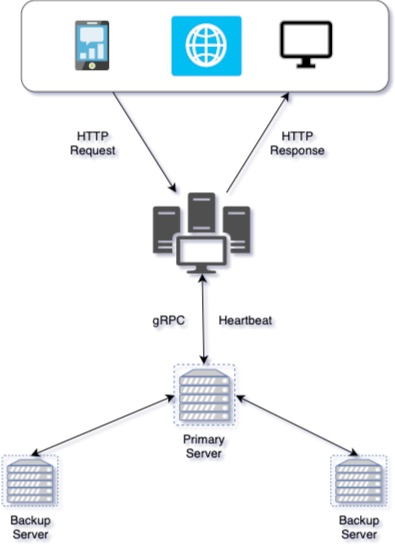

# Social_media_app-golang
Distributed Systems: Final Project

Team Members:
Shradha Ahuja (sa4741)
Sneha Munden (sm7352)

Architecture Diagram:

Setup:
Clone the repository and go to path ./grpc/server to run the Backend server. 
Run the backend server with command go run server.go
In other terminal go build the the files and run the main using command go run main.go
  
Go to - http://localhost:9090/login

